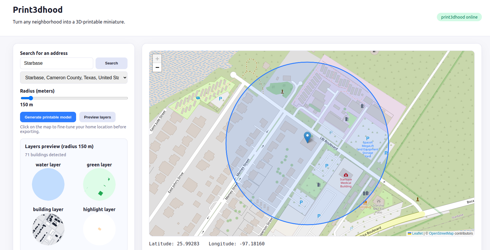

# print3dhood

Print3dhood turns any neighborhood into a stack of watertight, 3D-printable layers. A FastAPI backend contacts OpenStreetMap for footprints, roads, parks, and water, extrudes each layer with `shapely` + `trimesh`, and ships STL zips straight to the browser via a slick Leaflet UI with real-time previews.

Disclaimer: This app was vibe-coded in an afternoon using GPT5-CODEX. A certain amount of troubleshooting was required to make it work. It is unclear whether the printed pieces will stack, as there is zero clearance between them. This will need further work.



## Features

- **Search + pick with confidence** – Address search is powered by Nominatim and mirrored on an interactive Leaflet map so you can drag the marker or click directly on your home.
- **Radius-aware UX** – Slider + map overlay stay in sync (100–750 m), and the backend enforces identical bounds to keep Overpass within rate limits.
- **Instant layer previews** – The `Preview layers` button calls `/api/models/preview` and renders per-layer canvases so you can sanity-check the export without waiting for meshes.
- **Multi-layer exports** – Every request returns STL disks for water, land, streets, and an optional keyed highlight piece—plus `metadata.json` describing each building.
- **Resilient data pipeline** – Tile-based Overpass queries with retries, geometry cleanup via `shapely.make_valid`, and automatic height inference from OSM levels/height tags.
- **Container + cloud ready** – Single Dockerfile powers local `docker compose` and Cloud Run; health checks (`/api/health`) make it easy to monitor deployments.

## How it works

1. The UI queries `/api/geocode` to find candidate addresses and shows them on the map.
2. `/api/models` and `/api/models/preview` call `fetch_environment`, which splits the requested circle into Overpass tiles, collects buildings/roads/parks/water, and projects them into meters (EPSG:3857).
3. `mesher.py` scales everything down to a 20 cm print disk, extrudes each layer, produces an in-memory zip (STL only by default), and returns metadata + preview paths for client-side canvases.

## Project layout

```
app/
  config.py                  # Settings + env overrides
  main.py                    # FastAPI app, routes, streaming responses
  models.py                  # Pydantic schemas for API + previews
  services/
    geocoding.py             # Nominatim lookups + error handling
    overpass.py              # Tile-based Overpass fetch + projection helpers
    mesher.py                # Geometry prep, extrusion, zip bundling
static/
  css/styles.css             # UI styling
  js/app.js                  # Leaflet map, previews, API calls
templates/index.html         # Frontend shell (served by FastAPI)
Dockerfile, docker-compose.yml, requirements.txt
```

## Requirements

- Python 3.11+
- GDAL is **not** required; `pyproj`, `shapely`, and `trimesh` handle projections + meshing.
- Make sure `build-essential`/`libspatialindex` equivalents are installed if deploying on Alpine-based images (already covered in the provided Dockerfile).

## Running locally (Python)

```bash
python -m venv .venv
source .venv/bin/activate
pip install -r requirements.txt
cp .env.example .env  # optional overrides (USER_AGENT, API URLs, etc.)
uvicorn app.main:app --reload
```

Visit `http://127.0.0.1:8000/` to load the UI.

## Running with Docker Compose

```bash
docker compose up --build
```

Open `http://127.0.0.1:8080/`. Logs stream in the terminal; stop with `Ctrl+C`.

## Google Cloud Run deployment

1. Build + push the container to Artifact Registry (or Docker Hub):
   ```bash
   gcloud builds submit --tag gcr.io/<PROJECT_ID>/print3dhood:latest .
   ```
2. Deploy to Cloud Run (adjust region, service name, and env vars as needed):
   ```bash
   gcloud run deploy print3dhood \
     --image gcr.io/<PROJECT_ID>/print3dhood:latest \
     --region us-central1 \
     --platform managed \
     --allow-unauthenticated \
     --set-env-vars USER_AGENT="print3dhood/1.0 (contact: you@example.com)"
   ```
3. Cloud Run sets `PORT`; the image already respects it via `ENV PORT=8080` + uvicorn `--port $PORT`.

## Environment variables

All settings live in `app/config.py` and support `.env` overrides:

| Variable | Description | Default |
| --- | --- | --- |
| `USER_AGENT` | Required contact string for OSM services. | `print3dhood/1.0 (...)` |
| `OVERPASS_URL` | Overpass API endpoint. | `https://overpass-api.de/api/interpreter` |
| `OVERPASS_TIMEOUT` | Seconds before Overpass calls time out. | `120` |
| `OVERPASS_RETRIES` | Attempts per tile on 429/504 responses. | `3` |
| `OVERPASS_TILE_SIZE_M` | Tile width/height in meters for chunked Overpass queries. | `300` |
| `NOMINATIM_URL` | Geocoder endpoint. | `https://nominatim.openstreetmap.org/search` |
| `DEFAULT_RADIUS_M` | UI + backend default radius. | `250` |
| `MAX_RADIUS_M` | Hard limit applied server-side. | `750` |
| `MAX_BUILDINGS` | Safety valve for dense cities. | `250` |
| `BASE_THICKNESS_M` | Base/water layer thickness (per x). | `0.0075` |
| `GREEN_LAYER_THICKNESS_M` | Green layer thickness. | `0.0075` |
| `BUILDING_LAYER_THICKNESS_M` | Street slab thickness before buildings extrude. | `0.0075` |
| `ROAD_GROOVE_DEPTH_M` | Depth carved into the street layer for roads. | `0.0015` |
| `BUILDING_LAYER_PADDING_M` | Extra meters added around footprints for sidewalks. | `2.5` |
| `BASE_PADDING_M` | Extra meters added outside the radius for the circular crop. | `5` |
| `ROAD_INDENT_WIDTH_M` | Buffer width (m) applied to road centerlines. | `4` |
| `PARK_INDENT_SHRINK_M` | Optional inward offset applied to parks. | `1` |
| `TARGET_PRINT_DIAMETER_M` | Finished print diameter (meters). | `0.2` |
| `DEFAULT_HEIGHT_M` | Height (m) used when OSM lacks data. | `10` |
| `LEVEL_HEIGHT_M` | Per-level height for `building:levels`. | `3` |
| `MIN_HEIGHT_M` | Minimum allowed extrusion height. | `3` |
| `HIGHLIGHT_PEG_DEPTH_M` | Peg depth for the removable highlight piece. | `0.0045` |
| `HIGHLIGHT_ENABLED` | Enable highlight generation (`true`/`false`). | `True` |
| `ALLOWED_FORMATS` | Tuple of mesh formats the API accepts. | `("stl",)` |
| `MAX_FORMATS` | Max formats a client can request. | `3` |

## Using the app

1. Search for an address (or click directly on the map). The dropdown shows the best Nominatim matches.
2. Drag the marker or click again to fine-tune the center. The blue disk mirrors the chosen radius.
3. Hit **Preview layers** to fetch layer outlines and confirm building counts.
4. Click **Generate printable model**. The browser downloads `print3dhood_<radius>m_layers.zip` containing:
   - `layers/water_layer.stl` – base disk with water extrusions rising to street level.
   - `layers/green_layer.stl` – land disk with voids for water + park extrusions.
   - `layers/building_layer.stl` – street disk with engraved roads and all buildings except the highlighted one.
   - `layers/highlight_layer.stl` – keyed insert for the selected building (only when highlight mode is enabled).
   - `metadata.json` – building stats, scale ratio, and per-layer descriptions for slicer notes.

If no buildings overlap the requested area, the API returns `404` so the UI can prompt you to expand the search.

## API reference (quick glance)

| Method | Path | Description |
| --- | --- | --- |
| `GET` | `/api/health` | Lightweight readiness probe that returns `{status:"ok"}` + app name. |
| `GET` | `/api/geocode?query=<text>` | Forwards searches to Nominatim and returns an array of matches. |
| `POST` | `/api/models` | Generates STL layers + metadata zip for the given `ModelRequest`. |
| `POST` | `/api/models/preview` | Returns `metadata` + simplified paths for rendering preview canvases. |

Enjoy printing your neighborhood!
